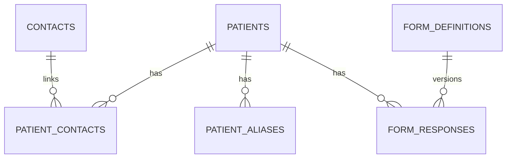

# Planned registry relationships

```mermaid
erDiagram
  PATIENTS ||--o{ PATIENT_CONTACTS : has
  CONTACTS ||--o{ PATIENT_CONTACTS : links
  PATIENTS ||--o{ PATIENT_ALIASES : has
  PATIENTS ||--o{ FORM_RESPONSES : has
  FORM_DEFINITIONS ||--o{ FORM_RESPONSES : versions
```

Conceptual only; this diagram does not represent an implemented database schema.
